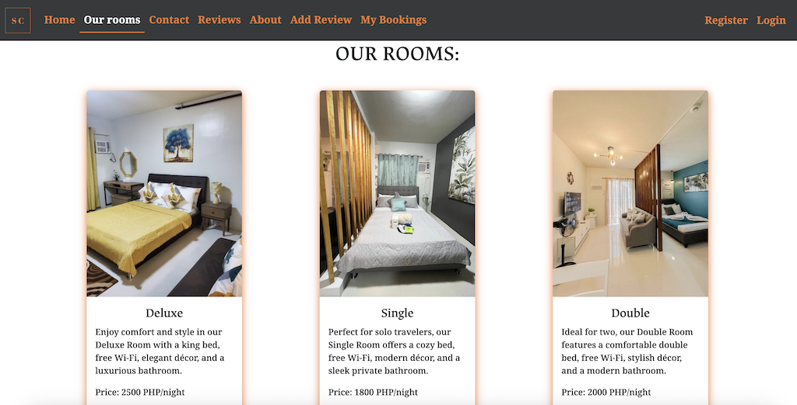
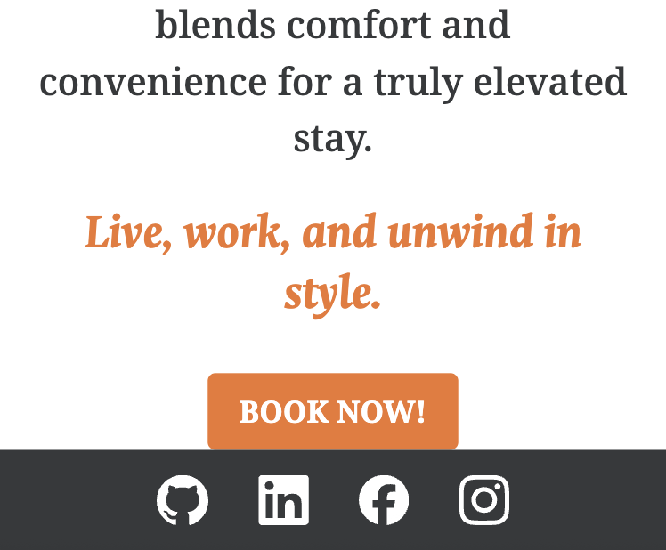
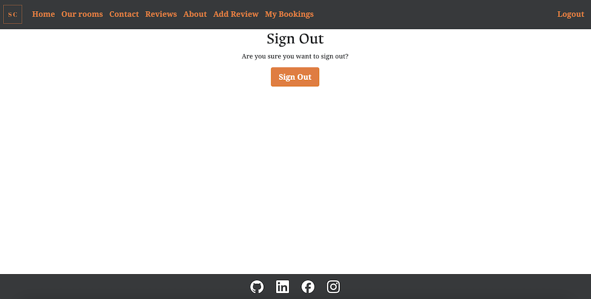

# STARY CONDOHOTEL

STARY CONDOHOTEL is a fully operational web application designed for accommodation services. The platform offers users access to a range of available room types, along with features to create personal accounts, manage profiles, make accommodation bookings, and leave reviews.

In addition to user-focused features, the site provides administrative tools that allow staff to manage bookings and reviews, and make changes on behalf of guests—ensuring a smooth and personalized accommodation booking experience.

## UX

The design philosophy focuses on creating a simple, colorful, and stylish look. The website features a smooth, intuitive flow, making it easy to navigate so users never feel lost or stuck.

### Colour Scheme and Fonts

The website features a primary color scheme of orange and graphite, creating an elegant and visually engaging browsing experience.

For typography, the title font is Ancízar Serif—a naturally diverse typeface designed for everyday use in a wide range of contexts. Its consistent structure enhances both readability and visual identity. For body text, Noto Serif is used, chosen for its versatility as part of a global font collection that supports writing in all modern and ancient languages.

ANCAZAR

NOTO

# Project Goals

### User Goals
- Browse Available Room Types: Users want to explore a variety of accommodation options with clear descriptions and images.
- Book Accommodation Easily: Users aim to check availability and book rooms quickly and securely through an intuitive booking system.
- Create and Manage Accounts: Users can register, log in, and update personal details to manage their bookings and preferences.
- Leave and Read Reviews: Guests want to share their experiences and read others' reviews to make informed decisions.
- Contact Hotel Staff: Users can fill out a contact form to inquire about bookings, room types, amenities, or special requests.
- Find Hotel Location: Users should be able to quickly locate the condo hotel and nearby attractions or parking options via an interactive map or location page.
- View Photo Gallery: Guests can browse a gallery showcasing rooms, amenities, and local surroundings to get a better feel for the place before booking.

### Site Owner Goals
- Increase the Number of Guests: Attract more customers by offering a seamless and engaging online booking experience.
- Promote the Business Professionally: Establish a strong and stylish online presence that reflects the quality and comfort of the condo hotel.
- Provide Essential Information: Clearly present key details about room types, pricing, amenities, and services to help users make informed decisions.
- Attract New Guests with Updated Offers: Capture potential customers by showcasing current room availability, seasonal deals, and curated holiday packages in a visually appealing and easy-to-navigate format.

# User Experience
### Target Audience
- Leisure Travelers: Individuals or families looking for a comfortable and stylish place to stay during their vacation or weekend getaway.
- Business Travelers: Professionals seeking convenient and well-equipped accommodation for work-related trips.
- Couples and Honeymooners: Guests looking for a romantic and relaxing stay in a scenic and peaceful setting.
- Event Attendees and Tourists: Visitors attending local events or exploring the area who need a reliable and pleasant lodging option.
- Travel Agencies and Partners: Businesses interested in partnering with the condo hotel to offer curated holiday packages or corporate bookings.

### User Requirements and Expectations
- Simple and Intuitive Navigation: A user-friendly layout that makes it easy for visitors to explore the site and find what they need.
- Quick Access to Relevant Information: Essential details like room types, pricing, availability, and amenities are easy to locate and understand.
- Reliable Links and Functional Features: All buttons, links, and interactive elements behave as expected for a smooth browsing experience.
- Responsive and Visually Appealing Design: The website maintains a polished, attractive look across all devices and screen sizes.
- Easy Contact Options: Users can quickly reach out to the condo hotel through a clearly accessible contact form or contact details.
- Accessibility for All Users: The site is designed with accessibility in mind to accommodate all visitors, including those with disabilities.
- Photo Gallery: High-quality images showcasing rooms, amenities, and the surrounding area provide a realistic preview of the experience.
- Social Media Integration: Links to the hotel’s social media pages open in new tabs, allowing users to stay connected without losing their place on the site.

### User Stories

#### First-time User
- As a first-time user, I want to know where the condo hotel is located.
- As a first-time user, I want to see room prices and availability.
- As a first-time user, I want to learn more about the different types of rooms and amenities offered.
- As a first-time user, I want to understand what experiences and services the condo hotel provides.
- As a first-time user, I want to view real photos of the rooms and facilities.
- As a first time user, I want to see video footage.
- As a first time user, I want to see real peoples reviews.
- As a first time user I want easly navigate to booking section and create a booking.

#### Returning User
- As a returning user, I want to quickly view the hotel’s location and nearby points of interest.
- As a returning user, I want an easy way to contact the hotel for questions or updates to my booking.
- As a returning user, I want to find and follow the condo hotel on social media to stay updated on news and special offers.
- As a returning user, I want to find my booking.
- As a returning user, I want to edit or delete the booking.
- As a returning user, I want to leave the honest review about my stay.

#### Site Owner
- As the site owner, I want to significantly reduce admin time by making essential information easily accessible on the website.
- As the site owner, I want users to recognize and trust STARY CONDOHOTEL as a reliable and professional accommodation provider.
- As the site owner, I want users to be able to contact us easily for inquiries, support, or special requests.
- As the site owner, I want to capture new business opportunities through the contact form and store user data securely.
- As the site owner, I want users to view high-quality images and videos that accurately represent the rooms, facilities, and surroundings.
- As the site owner, I want users to easily find our location through an interactive map or clear directions.
- As the site owner, I want to see guests reservations.
- As the site owner, I want to edit or delete guests reviews.
- As the site owner, I want to see messages that potential quests left by using our contact form.

# Features

 Wireframes 

### Home page

### Our rooms

### Contact

### Reviews

### About

### Add Review

### My Bookings

### Create Booking

### Edit Booking

### Delete Booking

### Sign In

### Sign Out

### Sign Up

Existing features

### Home page
- A large, prominent image carousel showcasing 5 high-resolution images of the building exterior and available amenities.
- A navigation bar with links to key public pages: Our Rooms, Contact, Reviews, and About.
- A secondary navigation section (accessible only to logged-in users) with tabs: Add Review, My Bookings, Register, and Login.
- A footer that includes social media links for easy access to external platforms.
- A prominently placed "Our Rooms" button centered on the carousel, optimized for better visibility and accessibility, especially on mobile devices.

#### MOBILE

### Our rooms

- A simple and clear overview of the different room types available.
- A consistent navigation bar that includes a visual indicator of the current page.
- A prominent "Book Now" call-to-action button that quickly redirects users to the booking section
- A uniform footer displayed across all pages for a cohesive browsing experience.

#### MOBILE

### Contact page
- A simple and easy-to-use contact form for quick inquiries.
- A consistent navigation bar that includes a visual indicator of the current page.
- Clearly displayed email address and telephone number for direct communication.
- An embedded Google Map highlighting our exact location for easy navigation.
- A uniform footer displayed across all pages for a cohesive browsing experience.

#### MOBILE

### Reviews page

- A dedicated reviews page showcasing authentic guest experiences and feedback from their stay.
- A consistent navigation bar that includes a visual indicator of the current page.
- A uniform footer displayed across all pages for a cohesive browsing experience.

#### MOBILE

### About page

- A description of what our guests can expect from our condohotel.
- A consistent navigation bar that includes a visual indicator of the current page.
- A uniform footer displayed across all pages for a cohesive browsing experience.
- A prominent "Book Now" call-to-action button that quickly redirects users to the booking section

#### MOBILE

### Add Review page (accessible if the user is logged in)

- An intuitive form that allows users to rate their stay and share their experience with ease.
- A submit button that redirects the user to the review page after submission.
- A consistent navigation bar that includes a visual indicator of the current page.
- A uniform footer displayed across all pages for a cohesive browsing experience.

#### MOBILE

### My Bookings page (accessible if the user is logged in)

- Here the user can see reservations made if any.
- A consistent navigation bar that includes a visual indicator of the current page.
- A uniform footer displayed across all pages for a cohesive browsing experience.

#### MOBILE

#### Page view displaying a single booking.

- The user can edit or delete their booking.
- A consistent navigation bar that includes a visual indicator of the current page.
- A uniform footer displayed across all pages for a cohesive browsing experience.

#### MOBILE

### Register

- Registration form
- Sign up button
- A consistent navigation bar
- A uniform footer displayed across all pages for a cohesive browsing experience.

#### MOBILE

### Login

- Login form
- Sign in button
- A consistent navigation bar
- A uniform footer displayed across all pages for a cohesive browsing experience.

#### MOBILE

### Logout
- Log out message
- Sign out button
- A consistent navigation bar
- A uniform footer displayed across all pages for a cohesive browsing experience.

#### MOBILE

### Booking form
- User-friendly booking form that includes fields for full name, check-in and check-out dates, number of guests, room type selection, and any additional information.
- A "Reserve" button to finalize and confirm the booking.
- A consistent navigation bar
- A uniform footer displayed across all pages for a cohesive browsing experience.

#### MOBILE

### Edit Booking
- User-friendly edit booking form that includes fields for full name, check-in and check-out dates, number of guests, room type selection, and any additional information.
- A "Update Booking" button to finalize and confirm the edit.
- A consistent navigation bar
- A uniform footer displayed across all pages for a cohesive browsing experience.

#### MOBILE

### Delete Booking
- Notification message informing the user about the deletion of a specific booking
- A "Confirm" button to proceed with the deletion
- A consistent navigation bar
- A uniform footer displayed across all pages for a cohesive browsing experience.

#### MOBILE

### Custom 404 page
- Notification message informing the user about the error.
- A "Home" button to proceed to home
- A consistent navigation bar
- A uniform footer displayed across all pages for a cohesive browsing experience.

### Custom 403 page
- Notification message informing the user about the error.
- A "Home" button to proceed to home
- A consistent navigation bar
- A uniform footer displayed across all pages for a cohesive browsing experience.

### Custom 500 page
- Notification message informing the user about the error.
- A "Home" button to proceed to home
- A consistent navigation bar
- A uniform footer displayed across all pages for a cohesive browsing experience.

### Languages
- HTML
- CSS
- Java Script
- Python

### Frameworks and Tools
- Git
- Github
- Google Fonts
- Google Maps
- Free Mockup generator
- Visual Studio Code
- Django
- PostgreSQL
- Heroku
- Gunicorn
- Bootstrap
- sycopg2
- Balsamiq
- CodeInstitute Database