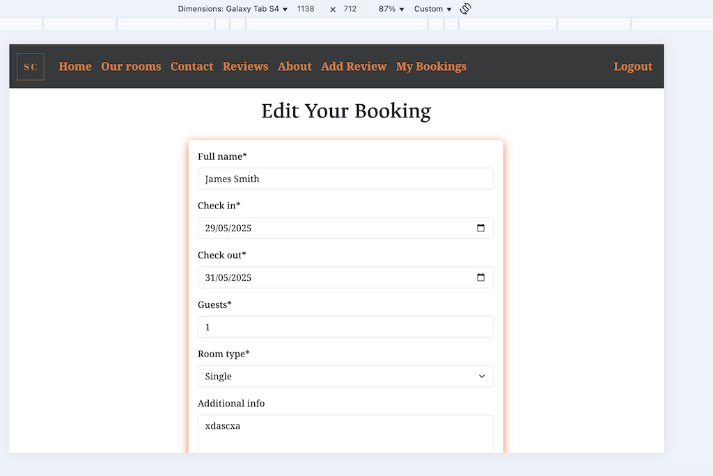
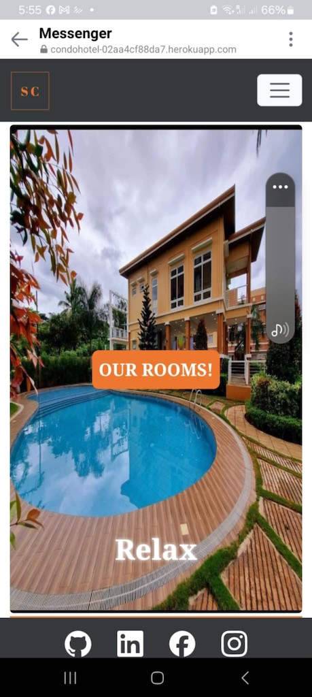

## HTML Validation

I used the [HTML W3C Validator](https://validator.w3.org) to validate my HTML files.

| Page | Screenshot | Notes |
| --- |--- | --- |
| Home page signed out | | Pass: No Errors |
| Home page signed in| | Pass: No Errors |
| Login| | Pass: No Errors |
| Logout| | Pass: No Errors |
| Signup| | Pass: No Errors |
| Password reset| | Pass: No Errors |
| Our rooms| | Pass: No Errors |
| Contact| | Pass: No Errors |
| Reviews| | Pass: No Errors |
| About| | Pass: No Errors |
| Add Review| | Pass: No Errors |
| My Booking| | Pass: No Errors |
| Edit Booking| | Pass: No Errors |
| Delete Booking| | Pass: No Errors |

## CSS

I used the [CSS Jigsaw Validator](https://jigsaw.w3.org/css-validator) to validate my CSS files.

## Python

I have used the [PEP8 CI Python Linter](https://pep8ci.herokuapp.com) to validate my Python files.

### Booking

| File | Screenshot | Notes |
| --- | --- | --- |
| admin.py |  | Pass: No Errors |
| apps.py |  | Pass: No Errors |
| forms.py|  | Pass: No Errors |
| models.py |  | Pass: No Errors |
| urls.py |  | Pass: No Errors |
| views.py |  | Pass: No Errors |

### Hotel

| File | Screenshot | Notes |
| --- | --- | --- |
| asgi.py |  | Pass: No Errors |
| settings.py |  | Pass: No Errors |
| urls.py |  | Pass: No Errors |
| views.py |  | Pass: No Errors |
| wsgi.py |  | Pass: No Errors |

### Reservation

| File | Screenshot | Notes |
| --- | --- | --- |
| admin.py |  | Pass: No Errors |
| apps.py |  | Pass: No Errors |
| forms.py |  | Pass: No Errors |
| models.py |  | Pass: No Errors |
| urls.py |  | Pass: No Errors |
| views.py |  | Pass: No Errors |

### Reviews

| File | Screenshot | Notes |
| --- | --- | --- |
| apps.py |  | Pass: No Errors |
| forms.py |  | Pass: No Errors |
| models.py |  | Pass: No Errors |
| views.py |  | Pass: No Errors |
| urls.py |  | Pass: No Errors |

### Rooms

| File | Screenshot | Notes |
| --- | --- | --- |
| apps.py |  | Pass: No Errors |
| models.py |  | Pass: No Errors |
| urls.py |  | Pass: No Errors |
| views.py |  | Pass: No Errors |

## Browser Compatability

I have tested my site on different browsers to check for any compatability issues.

| Browser | Screenshot | Notes |
| --- | --- | --- |
| Chrome |  | Works as expected |
| Safari |  | Works as expected |
| Firefox |  | Works as expected |
| Tor |  | Works as expected |

## Responsiveness

I have tested my site on different devices and screen sizes to check for any responsiveness problems.

### GENERAL RESPONSIVENESS
| Device | Screen |Screenshot | Notes |
| --- | --- | --- | --- |
| Mobile (Devtools)| Home page |  | Works as expected |
| Mobile (Devtools)| Our Rooms |  | Works as expected |
| Mobile (Devtools)| Contact Us |  | Works as expected |
| Mobile (Devtools)| Reviews |  | Works as expected |
| Mobile (Devtools)| About |  | Works as expected |
| Mobile (Devtools)| Add Review |  | Works as expected |
| Mobile (Devtools)| Book Now |  | Works as expected |
| Mobile (Devtools)| Your Booking |  | Works as expected |

### Samsung Galaxy Tab 4
| Device | Screen |Screenshot | Notes |
| --- | --- | --- | --- |
| Samsung Galaxy Tab 4 (Devtools)| Home page |  | Works as expected |
| Samsung Galaxy Tab 4 (Devtools)| Our Rooms |  | Works as expected |
| Samsung Galaxy Tab 4 (Devtools)| Contact Us |  | Works as expected |
| Samsung Galaxy Tab 4 (Devtools)| Reviews |  | Works as expected |
| Samsung Galaxy Tab 4 (Devtools)| Add Review |  | Works as expected |
| Samsung Galaxy Tab 4 (Devtools)| Edit Booking |  | Works as expected |
| Samsung Galaxy Tab 4 (Devtools)| Delete Booking |  | Works as expected |

### Iphone 13 REAL DEVICE TESTING

| Device | Screen |Screenshot | Notes |
| --- | --- | --- | --- |
| Iphone 13 | Home page |  | Works as expected |
| Iphone 13| Our Rooms |  | Works as expected |
| Iphone 13| Contact Us |  | Works as expected |
| Iphone 13| Reviews |  | Works as expected |
| Iphone 13| About |  | Works as expected |
| Iphone 13| Add Review |  | Works as expected |
| Iphone 13| Your Booking |  | Works as expected |
| Iphone 13| Edit Booking |  | Works as expected |
| Iphone 13| Delete Booking |  | Works as expected |
| Iphone 13| Login |  | Works as expected |
| Iphone 13| Logout|  | Works as expected |
| Iphone 13| Register |  | Works as expected |

### Samsung X Cover Pro 6 REAL DEVCE TESTIING - A few screenshots provided by a friend.

| Device | Screen |Screenshot | Notes |
| --- | --- | --- | --- |
| Samsung X Cover Pro 6 | Home page |  | Works as expected |
| Samsung X Cover Pro 6| Our Rooms |  | Works as expected |
| Samsung X Cover Pro 6| Our Rooms 2 |  | Works as expected |
| Samsung X Cover Pro 6| Our Rooms 3 |  | Works as expected |

## Lighthouse

I've tested my deployed project using the Lighthouse tool to check for issues.

| Page | Size | Screenshot | Notes |
| --- | --- | --- | --- |
| Home | Desktop |  | n/a |
| Our Room | Desktop |  | Small performance issue |
| Contact| Desktop |  | Best Practices due to 3rd party cookies (google maps) |
| Reviews | Desktop |  | n/a |
| Add Review | Desktop |  | n/a |
| Bookings | Desktop |  | n/a |

## WAVE EVALUATION

I tested my deployed project using the WAVE evaluation tool to assess accessibility.

All pages flagged a contrast issue related to the orange button with white text. While this does not meet standard contrast requirements, the button contains large text and is prominently sized. As it aligns with our established design patterns, we have decided to retain this styling.

| TOOL | Screen |Screenshot | 
| --- | --- | --- | 
| WAVE | Home page |  |
| WAVE | Our Rooms |  | 
| WAVE | Contact Us |  | 
| WAVE | Reviews |  |
| WAVE | About |  |
| WAVE | Add Review |  | 
| WAVE | Logout|  |

